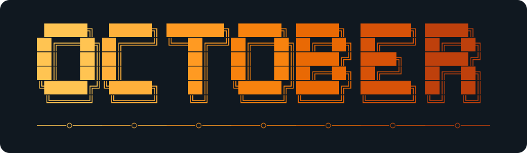
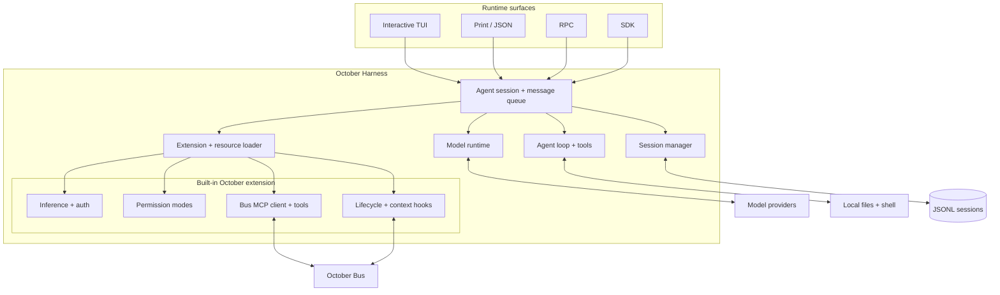

<div align="center">



<h1>October Harness</h1>

<p><strong>October's open, multiplayer-first coding harness.</strong></p>

Fast in a terminal. Extensible as a runtime. Native to October Bus.

[](https://www.npmjs.com/package/@october-dev/october)
[](LICENSE)
[](https://github.com/october-dev/october-bus)
[](https://github.com/earendil-works/pi)

</div>

---

**October Harness is a complete open-source coding agent built to work alone and with other agents.** Run it as an interactive terminal partner, a one-shot command, a JSON process, an RPC server, or an embedded SDK. Use October inference or bring another supported model provider.

October discovers tools automatically from the public [October Bus](https://github.com/october-dev/october-bus) launcher or October Desktop. Agents can pull durable messages, acknowledge handled work, coordinate tasks, and send correlated replies. Public Bus delivery is pull-only: idle agents do not wake automatically. Desktop additionally supplies session and turn context through its hook protocol.

October Bus is the open communication substrate. October is the runtime and control plane above it, adding the visual workspace, automatic staffing, harness selection, quota-aware routing, cross-machine operation, supervision, outcome learning, and Autopilot.

October Harness started as a fork of [Pi](https://github.com/earendil-works/pi). Pi remains the foundation for much of the agent core, provider layer, TUI, session model, and extension system. The project has since been substantially changed for October with its own package and CLI, inference and authentication, permission modes, Bus-native tools and hooks, October context handling, managed Desktop runtime, and product identity.

## Why another coding harness?

Claude Code, Codex, and Pi already prove that a terminal is a powerful place to work with an agent. October Harness is not an attempt to hide another agent loop or lock developers into a private implementation.

It exists to be the open reference harness for **multiplayer-native development**:

- useful as a serious standalone coding agent;
- native to agent discovery, durable messaging, delegation, and replies;
- transparent enough for developers to inspect, extend, and self-host;
- concrete enough to show other harness authors what first-class October Bus support looks like;
- deeply integrated with October without exposing October's private cloud or intelligence layer.

Pi optimizes for a small, extensible core. October Harness keeps that foundation and makes a different product choice: multiplayer behavior is part of the first-party runtime, not an afterthought bolted onto a `send_message()` function.

## Compared with OpenCode and Cline

October's focus is built-in October Bus support: discovering other agents, exchanging durable messages, and coordinating shared tasks. OpenCode and Cline also support working with multiple agents; the difference is how they connect and coordinate.

| Area | October Harness | OpenCode | Cline |
| --- | --- | --- | --- |
| Interfaces | [Terminal, print/JSON, RPC, embedded SDK](#standalone-usage) | [Terminal, desktop, IDE](https://opencode.ai/docs/); [headless CLI](https://opencode.ai/docs/cli/), [HTTP server/client SDK](https://opencode.ai/docs/sdk/) | [IDE extensions, CLI, desktop, embedded SDK](https://github.com/cline/cline#readme) |
| Collaboration | [Bus peers, durable messages, shared tasks](#two-harnesses-one-bus) | [Primary agents and subagents](https://opencode.ai/docs/agents/) | [Persistent teams with a task board and mailbox](https://docs.cline.bot/cli/agent-teams) in CLI, SDK, and Kanban; not yet in IDE extensions |
| Customization | [TypeScript extensions, skills, prompts, themes, packages](#extensions-and-customization) | [Plugins](https://opencode.ai/docs/plugins/), [skills](https://opencode.ai/docs/skills/), [MCP servers](https://opencode.ai/docs/mcp-servers/) | [Skills](https://docs.cline.bot/customization/skills), [MCP servers](https://github.com/cline/cline#readme); [plugins](https://docs.cline.bot/customization/plugins) in CLI, SDK, and Kanban |
| Permissions | [`ask`, `accept-edits`, `bypass`](#tool-permissions); default is `bypass` | [Per-tool `allow`, `ask`, `deny` rules](https://opencode.ai/docs/permissions/) | [Tool approvals and configurable auto-approve](https://docs.cline.bot/features/auto-approve) |

This is not a complete feature list. Documentation checked September 10, 2026; availability varies by version and interface. October's approval controls are not an OS sandbox; see [Security](#security).

## Contents

- [Compared with OpenCode and Cline](#compared-with-opencode-and-cline)
- [Five-minute quickstart](#five-minute-quickstart)
- [Update October Harness](#update-october-harness)
- [Authentication, models, and providers](#authentication-models-and-providers)
- [Standalone usage](#standalone-usage)
- [Two harnesses, one Bus](#two-harnesses-one-bus)
- [Using it inside October](#using-it-inside-october)
- [Sessions and permissions](#sessions-and-permissions)
- [Architecture](#architecture)
- [Extensions and customization](#extensions-and-customization)
- [What changed from Pi](#what-changed-from-pi)
- [Open-source boundary](#open-source-boundary)
- [Contributing and upstream sync](#contributing-and-upstream-sync)
- [Roadmap](#roadmap)
- [Security](#security)
- [License and attribution](#license-and-attribution)

## Five-minute quickstart

October Harness requires Node.js 22.19 or newer.

```bash
npm install -g --ignore-scripts @october-dev/october
october login
cd /path/to/your/project
october
```

Ask for a quick orientation:

```text
Summarize this repository, explain how to run its checks, and suggest the highest-leverage next task.
```

October can read, write, and edit files, run shell commands, inspect the repository, and retain the session so you can continue later.

Already have another provider account? Start `october`, run `/login`, select the provider, then use `/model` to choose a model.

## Update October Harness

For a global npm installation, install the latest release and verify the version:

```bash
npm install -g --ignore-scripts @october-dev/october@latest
october --version
```

Restart running harness sessions to use the update. Your saved credentials, settings, and sessions are preserved. October Desktop manages its own harness version; this command updates only the standalone npm installation.

## Authentication, models, and providers

### October inference

```bash
october login
```

Standalone login uses a device-code flow and stores a revocable credential under `~/.october/agent/`. Inside October Desktop, the app injects and refreshes the signed-in session, so no separate login is required.

The built-in October provider refreshes its model catalog from the October inference gateway. Its offline seed catalog includes:

- `october/Qwen/Qwen3.6-35B-A3B-FP8`: the recommended default, with text input and reasoning;
- `october/Kimi-K2.7-Code`: a text-and-image model retained for deployments that provide access.

Existing saved model choices are preserved. If a session still selects Kimi and receives `model use not permitted`, use `/model` to select Qwen3.6 or pass `--provider october --model october/Qwen/Qwen3.6-35B-A3B-FP8`.

Use `/model` in the TUI or inspect available models from the shell:

```bash
october --list-models
october --provider october
```

### Subscription providers

Run `/login` to use supported subscriptions for ChatGPT Plus/Pro (Codex), Claude Pro/Max, GitHub Copilot, xAI, OpenRouter, or Radius.

### API-key and cloud providers

The inherited multi-provider layer supports Anthropic, OpenAI, Azure OpenAI, Google Gemini and Vertex AI, Amazon Bedrock, DeepSeek, xAI, OpenRouter, Mistral, Groq, Cerebras, NVIDIA NIM, Cloudflare AI Gateway and Workers AI, Vercel AI Gateway, Hugging Face, Fireworks, Together AI, Baseten, Kimi, MiniMax, Qwen, Xiaomi, ZAI, OpenCode, and other compatible endpoints.

Set an environment variable or use `/login` to store a key in `~/.october/agent/auth.json`:

```bash
export ANTHROPIC_API_KEY=sk-ant-...
october
```

Custom model catalogs can connect Ollama, LM Studio, vLLM, and services implementing supported OpenAI, Anthropic, or Google APIs. Custom provider extensions can add new APIs and OAuth flows. See the full [provider guide](packages/coding-agent/docs/providers.md) and [custom model guide](packages/coding-agent/docs/models.md).

## Standalone usage

October is a complete local harness even when no October app or Bus is present.

| Mode | Command or surface | Best for |
| --- | --- | --- |
| Interactive | `october` | Pairing in the terminal |
| Print | `october -p "Review this diff"` | One-shot tasks and scripts |
| JSON | `october --mode json` | Structured pipelines and CI |
| RPC | `october --mode rpc` | Driving a persistent agent from another process |
| SDK | Import `@october-dev/october` | Embedding the agent in another application |

Common commands:

```bash
october -c                         # continue the latest session
october -r                         # browse previous sessions
october --name "Auth refactor"     # name a new session
october --no-session               # run without persistence
october -p "Summarize this repo"   # one-shot prompt
```

Bus integration is execution-gated. Public Bus requires the launcher's address, MCP URL, agent ID, execution ID, and agent token. Desktop uses its port, canvas, and node contract. With neither valid configuration, October registers no Bus tools or hooks. Startup never prints “What's New”; use `/changelog` explicitly to view release history.

## Two harnesses, one Bus

Start a local [October Bus](https://github.com/october-dev/october-bus), create a scope, and keep its scope token in the launching shell. In separate terminals, using the same scope:

```bash
# Terminal 1
OCTOBER_BUS_SCOPE_TOKEN=<scope-token> october-bus agent run --id planner --name Planner -- october
# Terminal 2
OCTOBER_BUS_SCOPE_TOKEN=<scope-token> october-bus agent run --id builder --name Builder --connect-to planner -- october
```

The launcher injects execution-scoped credentials; October discovers MCP tools without a separate MCP configuration. The scope token is not passed to October. Submit a prompt to each agent: this adapter does not automatically wake an idle session. In Desktop, launch the harness in two terminal nodes on one canvas; Desktop uses its own hook contract.

Ask the first agent:

```text
Find the other agent on this canvas. Delegate a review of the authentication flow,
then wait for its answer and summarize the result for me.
```

The collaboration is visible in protocol operations:

```text
planner  → list_peers()
bus      → builder [attached, ready, local]

planner  → message_peer(builder, mode=request,
                         "Review the authentication flow for failure cases.")
bus      → request accepted durably as msg_01

builder  → check_inbox()
planner  → add_task(title="Review authentication flow") → task_01
builder  → claim_task(taskId=task_01)
builder  → message_peer(planner, mode=response, responseTo=msg_01,
                         "Found two gaps: expired-device-code recovery and token revocation UX.")

builder  → acknowledge_messages(messageIds=[msg_01])
planner  → check_inbox() → correlated response received
```

This is more than agent-to-agent chat. The Bus keeps peer identity, reachability, durable delivery, request/reply correlation, shared tasks, dependencies, lifecycle, and human escalation as explicit protocol state. A peer request never expands the receiving harness's permissions.

## Using it inside October

October Harness is the first-party terminal agent for the October Desktop app:

- **Zero-config authentication.** Desktop supplies and refreshes the current October session.
- **Managed runtime.** Desktop controls its installed harness version. Updating npm alone does not update a Desktop-pinned installation.
- **Bus-native collaboration.** The harness receives an execution-scoped identity and registers peer, inbox, task, and status tools from the local Bus.
- **Lifecycle hooks.** Desktop receives session live/offline, pre-prompt, and turn-stop hooks. User-dialog readiness and background inbox wake-up are not implemented. Public Bus registration, heartbeat, and shutdown belong to its launcher.
- **October context.** Bounded orientation, peer, inbox, and summary context can enter the agent at the appropriate prompt boundary.
- **Local authority.** Bus credentials and process identity belong to one execution and disappear when that run ends.

The CLI remains the same harness in both environments. October integration adds context and collaboration; it does not replace the open runtime with a private agent implementation.

## Sessions and permissions

### Sessions

Sessions are append-only JSONL trees stored under `~/.october/agent/sessions/`, grouped by working directory. They preserve messages, tool results, model and thinking changes, compactions, labels, extension state, and alternate branches.

| Command | Behavior |
| --- | --- |
| `/resume` | Browse saved sessions |
| `/new` | Start a fresh session |
| `/name <name>` | Give the session a human-readable name |
| `/session` | Show the current file, ID, messages, tokens, and cost |
| `/tree` | Move through the current session's branch tree |
| `/fork` | Start a new session from an earlier user message |
| `/clone` | Copy the active branch into a new session |
| `/compact` | Summarize older context for a longer working session |
| `/export` | Export the session for review |

See [Sessions](packages/coding-agent/docs/sessions.md), [Compaction](packages/coding-agent/docs/compaction.md), and the [session format](packages/coding-agent/docs/session-format.md).

### Tool permissions

October adds three explicit tool-permission modes:

| Mode | Reads | File edits | Shell and other commands |
| --- | --- | --- | --- |
| `ask` | Allow | Ask | Ask |
| `accept-edits` | Allow | Allow | Ask |
| `bypass` | Allow | Allow | Allow |

Set the process policy with `--permission-mode`, then `OCTOBER_PERMISSION_MODE`, then global `~/.october/agent/settings.json` (in that precedence order). The default is `bypass`. Trusted project `.october/settings.json` may only tighten that policy; untrusted project settings are ignored. Policy is fixed for the session, so tool edits cannot grant more authority. Restart with an explicit user-selected mode to change it. Non-interactive operations requiring approval are blocked.

Project trust is separate from tool permissions. It controls whether October loads project-local settings, extensions, skills, prompts, themes, and packages. It is an input-loading boundary, not a sandbox.

## Architecture



The public monorepo contains the full path from CLI input to model request, tool execution, session persistence, and Bus collaboration. October's built-in extension uses the same public extension surface available to developers.

## Extensions and customization

October is designed to be changed at the edges:

| Extension point | What it changes |
| --- | --- |
| TypeScript extensions | Tools, commands, providers, events, UI, and lifecycle behavior |
| Skills | Reusable instructions and domain workflows loaded on demand |
| Prompt templates | Repeatable prompts exposed as slash commands |
| Themes | TUI colors and presentation |
| Packages | Shareable bundles installed from npm or Git |

Start with the [documentation index](packages/coding-agent/docs/index.md), then explore [extensions](packages/coding-agent/docs/extensions.md), [skills](packages/coding-agent/docs/skills.md), [prompt templates](packages/coding-agent/docs/prompt-templates.md), [themes](packages/coding-agent/docs/themes.md), the [RPC protocol](packages/coding-agent/docs/rpc.md), and the [SDK](packages/coding-agent/docs/sdk.md).

## What changed from Pi

October Harness is a real downstream product, not a renamed Pi binary. We continue to inherit and credit substantial upstream work while maintaining October-specific behavior in this repository.

| Area | Pi foundation retained | October-specific work |
| --- | --- | --- |
| Runtime | Agent loop, tools, provider abstraction, TUI, sessions, RPC, SDK | `october` CLI/package identity, `.october` configuration, managed distribution |
| Models | Multi-provider APIs and catalogs | October inference provider, dynamic October catalog, device login, Desktop session refresh |
| Collaboration | General extension primitives | Public/desktop Bus MCP tools, pull-based durable inbox and task operations, Desktop session/turn hooks |
| Context | Project instructions, skills, prompts, extensions | Bus orientation and peer/inbox context, execution identity, turn summaries |
| Permissions | Project trust and host-process security model | `ask`, `accept-edits`, and `bypass` tool-permission modes |
| Product integration | Portable terminal harness | October header, Desktop launch contract, safe self-update and first-party runtime behavior |

October publishes only [`@october-dev/october`](packages/coding-agent). It does not republish the upstream `@earendil-works/pi-coding-agent` package. The upstream workspace package names and required notices are preserved.

## Open-source boundary

This repository contains the usable harness:

- CLI, interactive TUI, headless modes, RPC runtime, and SDK;
- model and provider support;
- session persistence, branching, compaction, and export;
- project trust and October permission modes;
- October inference and standalone authentication;
- October Bus integration, agent-to-agent tools, lifecycle hooks, and context handling;
- the extension, skill, prompt, theme, and package systems needed to customize it.

It does **not** contain October backend secrets, private inference credentials, internal admin tooling, proprietary Autopilot or team-staffing logic, quota-routing intelligence, enterprise controls, or October's hosted cloud control plane.

The open harness should be enough to run, study, extend, and use as a reference implementation without needing access to October's private product systems.

## Repository layout

| Package | Role |
| --- | --- |
| [`@october-dev/october`](packages/coding-agent) | October CLI, SDK, permissions, inference, and Bus integration |
| [`@earendil-works/chord`](packages/chord) | Application-composition runtime for services, replicated state, RPC, and plugins |
| [`@earendil-works/pi-agent-core`](packages/agent) | Agent loop, tool calling, and state management |
| [`@earendil-works/pi-ai`](packages/ai) | Unified multi-provider model API |
| [`@earendil-works/pi-tui`](packages/tui) | Differentially rendered terminal UI |
| [`@earendil-works/pi-protocol`](packages/protocol) | RPC protocol types and transport contract |
| [`@earendil-works/pi-client`](packages/client) | Client for remote agent sessions |
| [`@earendil-works/pi-server`](packages/server) | Server runtime for remote sessions |
| [`@earendil-works/pi-telemetry`](packages/telemetry) | Shared, privacy-aware telemetry primitives |

## Contributing and upstream sync

October welcomes fixes, documentation, new provider support, extensions, and improvements to its Bus-native behavior. Read [CONTRIBUTING.md](CONTRIBUTING.md) and [AGENTS.md](AGENTS.md) before making changes.

```bash
git clone https://github.com/october-dev/october-harness.git
cd october-harness
npm install --ignore-scripts
npm run build:offline
npm run check
./test.sh
```

Our upstream policy is straightforward:

- keep Pi copyright, MIT license, package attribution, and provenance intact;
- treat Pi as the source of truth for inherited code and track it through explicit, reviewable upstream merges;
- prefer sending generally useful, October-neutral fixes upstream when practical;
- keep October-specific inference, Bus, permission, Desktop, and product behavior in this repository;
- resolve upstream conflicts without weakening October's public harness or Bus contracts;
- document meaningful divergence so contributors can tell which project owns a behavior.

For substantial October-specific work, open an issue before implementation. If a change belongs cleanly in Pi, contributors are encouraged to coordinate it upstream first and then bring it back through the normal sync path.

## Roadmap

- Make the October Harness the clearest reference implementation of the October Bus compatibility contract.
- Complete released-harness Bus conformance evidence, then add opt-in idle delivery and user-dialog readiness signals.
- Expand adapter and conformance examples for mixed-harness teams.
- Keep provider and model support current without coupling the harness to one inference backend.
- Improve session portability between standalone, Desktop, RPC, and SDK usage.
- Continue upstreaming generally useful runtime, TUI, provider, and session improvements.
- Grow the extension ecosystem without moving proprietary orchestration into the open harness.

## Security

October Harness is a local coding agent. It runs with the operating-system permissions of the user who starts it and does not claim to provide an in-process sandbox.

- Review project trust before loading repository-owned settings, extensions, skills, prompts, themes, or packages.
- Choose an October permission mode appropriate for the task.
- Use a container, VM, micro-VM, or policy-controlled sandbox for untrusted or unattended work.
- Mount only the files and credentials the task needs.
- Treat third-party extensions and skills as executable code and instructions.
- Review changes before committing or deploying them.
- Remember that Bus peers can request work but cannot grant new local authority.

Credentials are stored under `~/.october/agent/`; Bus capabilities, tokens, process identity, and readiness evidence are execution-scoped and remain local.

Report vulnerabilities privately through this repository's [security policy](SECURITY.md) or [GitHub Security Advisories](https://github.com/october-dev/october-harness/security/advisories/new). Do not open a public issue for a security-sensitive report.

## License and attribution

October Harness is licensed under the [MIT License](LICENSE).

It began as a fork of [Pi](https://github.com/earendil-works/pi), and substantial portions of the agent core, AI layer, TUI, sessions, extensions, and supporting packages originate from Pi and its contributors. The required upstream copyright, license, package names, and attribution notices are preserved.

October-specific changes are distributed under the same MIT terms. The license covers the code in this repository; it does not grant rights to October's names, logos, or other brand assets.

---

<div align="center">

Built in the open by [October](https://october.dev), on the open-source [Pi](https://github.com/earendil-works/pi) foundation.

</div>
